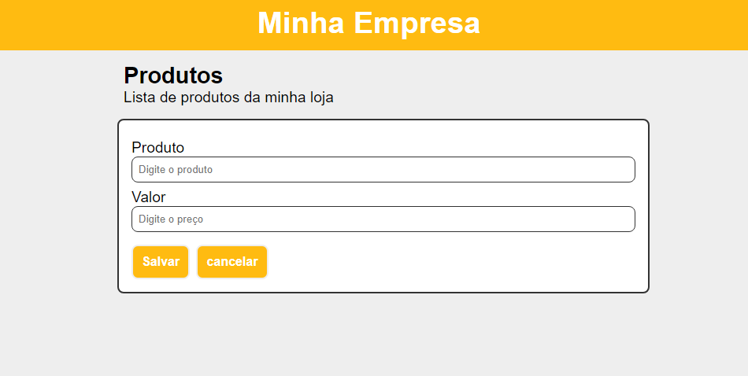
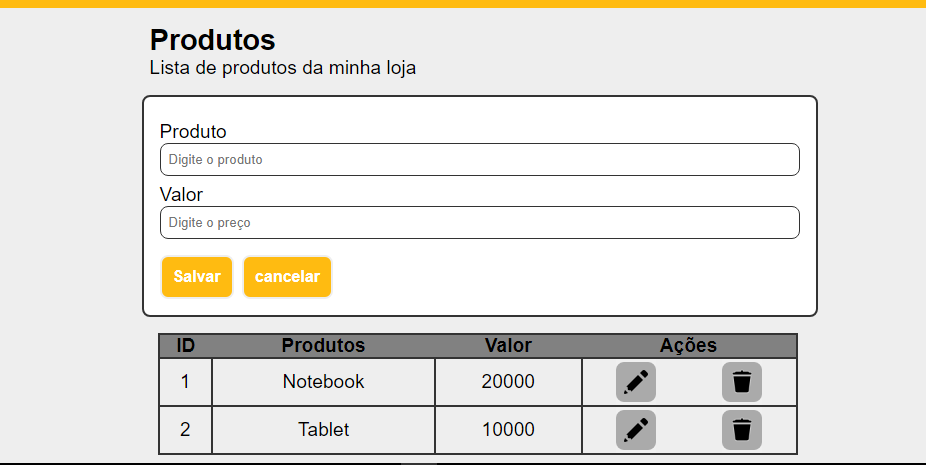

# Projeto CRUD React

Este `Projeto` foi desenvolvido para fins de exercicíos com o objetivo de melhorar as minhas `habilidades` em `React`. Básicamente o `projecto` tem a função de `adicionar` `editar` e `excluir` `itens` numa determinada `tabela` com uma boa esperiência do usuário em navegar no site os campos estão perfeitamentes validados.

## Tecnologias

As seguintes ferramentas foram usadas na constuição deste projeto:

- HTML
- CSS
- REACT

#

Feito por ❤ Pascoal Kahamba meu [Linkedin](https://www.linkedin.com/in/pascoal-kahamba-7b43bb233?lipi=urn%3Ali%3Apage%3Ad_flagship3_profile_view_base_contact_details%3BTg8LEKayToyytOX1pVAQ%2Bg%3D%3D)

[👉Clique aqui para rodar o projeto👈](https://project-crud.vercel.app/)😎
